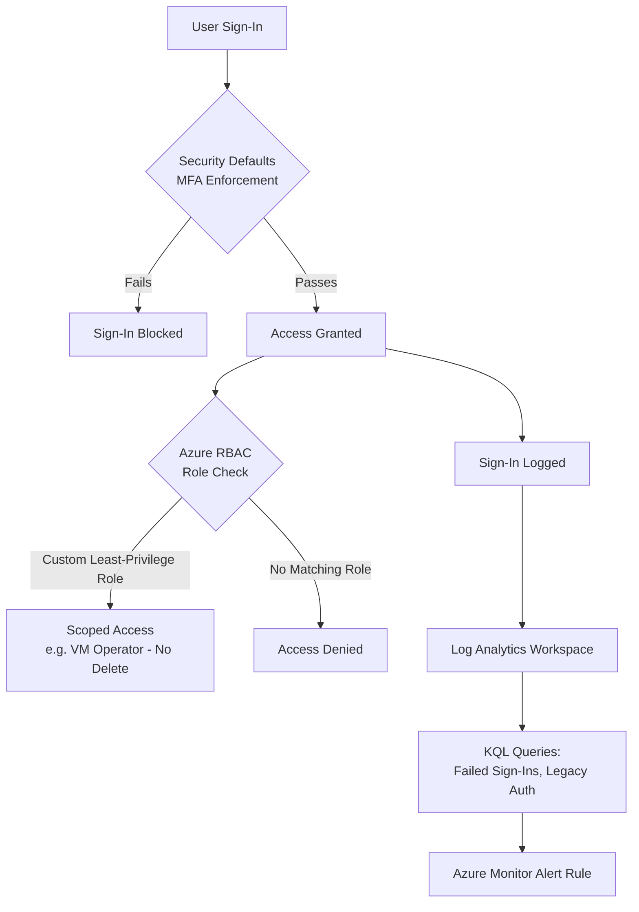

# Azure RBAC & Identity Baseline Governance Lab

A hands-on identity and access governance lab built entirely on a free Azure/Entra ID
tenant — no P1/P2 licensing required. Demonstrates least-privilege access control via
custom Azure RBAC roles, baseline identity security via Entra ID Security Defaults, and
sign-in monitoring via Log Analytics and KQL.

## Problem Statement

Identity is the primary attack surface in financial services — most breaches start with
compromised credentials or over-permissioned accounts, not network intrusion. This lab
demonstrates how to reduce that attack surface using tools available on every Azure
tenant, free or paid: Azure RBAC, Entra ID Security Defaults, and Azure Monitor.

**Note on scope:** Microsoft Entra ID Conditional Access and PIM require P1/P2
licensing and were deliberately excluded to keep this lab reproducible on a genuinely
free subscription — see `docs/architecture.md` for the licensing rationale and what
this project would add if deployed with P1/P2 in an enterprise setting.

## Architecture

## What's Included

| Component | Purpose |
|---|---|
| `security-defaults/` | Documentation of Entra ID Security Defaults configuration and what it enforces |
| `rbac/custom-roles/` | Custom Azure RBAC role definitions (JSON) implementing least privilege |
| `rbac/access-review-checklist.md` | Manual quarterly access review process (in place of PIM access reviews) |
| `monitoring/kql-queries/` | KQL queries against sign-in logs for failed/legacy auth detection |
| `monitoring/alert-rule-config.md` | Azure Monitor alert rule configuration for suspicious sign-ins |
| `scripts/` | Azure CLI scripts to create/assign the custom roles and export live config |
| `docs/architecture.md` | Design rationale, licensing constraints, and threat model |
| `docs/screenshots/` | Evidence of working configuration in the Azure/Entra portal |

## Threat Model Summary

| Control | Threat It Mitigates |
|---|---|
| Security Defaults (MFA via Authenticator) | Credential theft alone is insufficient to sign in |
| Custom Azure RBAC roles (least privilege) | Over-permissioned accounts (e.g. blanket Contributor) increase blast radius if compromised |
| Sign-in log monitoring + alerting | Detects brute-force/password-spray patterns and legacy auth attempts that bypass modern controls |
| Manual quarterly access reviews | Catches privilege creep even without automated PIM tooling |
| Break-glass emergency access account | Ensures recovery access if the primary admin account is locked out |

## Prerequisites

- Azure free subscription
- Entra ID Free tier (no P1/P2 required)
- Global Administrator or Owner role on the subscription during setup

## Cost

- Custom RBAC roles and Security Defaults: zero cost, licensing-tier features only
- Log Analytics workspace: free monthly ingestion grant covers this lab's volume comfortably
- Azure Monitor scheduled query alert rule: small per-rule cost (a few cents/month) — noted here for transparency rather than claimed as fully free

## Setup Guide

See [`docs/setup-guide.md`](docs/setup-guide.md) for the full step-by-step walkthrough,
including where to take each screenshot.

## Author

Jane — Cloud & Infrastructure Engineer, AZ-104 candidate.
Part of a broader Azure governance portfolio: see also
[Hub-Spoke Landing Zone], [Identity & Access Governance], [Enterprise Landing Zone].
